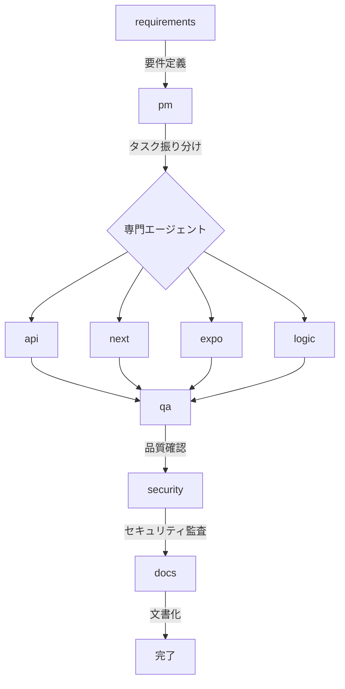

# エージェント定義書

## 1. 概要

SpecAgentXシステムにおける専門エージェントの定義と役割、連携方法を記述します。
各エージェントは特定の領域に特化し、相互に連携してプロジェクトを推進します。

## 2. コアエージェント一覧

### 2.1 エージェント概要

| エージェント名 | 責務 | 優先度 | 専門領域 |
|--------------|------|--------|----------|
| requirements | 要件定義の作成・管理 | High | 要件分析、仕様策定 |
| pm | プロジェクト管理・タスク振り分け | High | プロジェクト管理、スケジューリング |
| api | バックエンドAPI開発 | High | Go-Zero、REST API、gRPC |
| logic | ビジネスロジック実装 | High | ドメイン駆動設計、ビジネスルール |
| next | Next.jsフロントエンド開発 | Medium | React、Next.js 15、TypeScript |
| expo | モバイルアプリ開発 | Medium | React Native、Expo SDK 51 |
| infra | インフラ構築・管理 | High | Docker、Kubernetes、CI/CD |
| qa | 品質保証・テスト | High | 自動テスト、E2Eテスト、品質管理 |
| uiux | UI/UXデザイン | Medium | UIデザイン、アクセシビリティ、CSS |
| security | セキュリティ監査 | High | セキュリティ、認証、脆弱性対策 |
| docs | ドキュメント作成 | Medium | 技術文書、API仕様書、ユーザーガイド |
| setup | 環境構築・初期設定 | High | 開発環境、依存関係管理 |

## 3. エージェント詳細定義

### 3.1 requirements エージェント

**責務:**
- 要件定義書（REQUIREMENTS.md）の作成と管理
- ビジネス要件の分析と文書化
- ステークホルダー要求の整理
- 要件変更の影響分析

**主要スキル:**
- 要件分析手法
- ユーザーストーリー作成
- ユースケース図作成
- 要件トレーサビリティ管理

**使用ツール:**
- Read, Write, Edit, MultiEdit
- TodoWrite (要件タスク管理)

**成果物:**
- REQUIREMENTS.md
- ユーザーストーリー
- 受入基準

### 3.2 pm エージェント

**責務:**
- プロジェクト全体の進捗管理
- タスクの作成と適切なエージェントへの振り分け
- スケジュール管理とマイルストーン設定
- リスク管理と課題追跡

**主要スキル:**
- アジャイル/スクラム手法
- タスク優先順位付け
- リソース配分最適化
- 進捗レポート作成

**使用ツール:**
- TodoWrite (タスク管理)
- Task (サブタスク実行)
- Read (状況把握)

**成果物:**
- タスクリスト
- 進捗レポート
- リスク管理表

### 3.3 api エージェント

**責務:**
- Go-Zeroフレームワークを使用したバックエンドAPI開発
- OpenAPI仕様に基づくREST API実装
- gRPCサービスの実装
- データベース設計とマイグレーション

**主要スキル:**
- Go言語プログラミング
- go-zero フレームワーク (v1.7.0)
- OpenAPI 3.1.0仕様
- PostgreSQL、Redis

**使用ツール:**
- Read, Write, Edit, Bash
- Grep (コード検索)
- goctl (コード生成)

**成果物:**
- APIエンドポイント実装
- OpenAPI仕様書
- データベーススキーマ

### 3.4 logic エージェント

**責務:**
- ビジネスロジックの設計と実装
- ドメイン駆動設計（DDD）の適用
- ビジネスルールの実装
- ドメインモデルの構築

**主要スキル:**
- ドメイン駆動設計
- Clean Architecture
- デザインパターン
- SOLID原則

**使用ツール:**
- Read, Write, Edit, MultiEdit
- Grep (コード分析)

**成果物:**
- ドメインモデル
- ビジネスロジック層
- ユースケース実装

### 3.5 next エージェント

**責務:**
- Next.js 15を使用したフロントエンド開発
- React Server Componentsの実装
- UIコンポーネントの作成
- 状態管理とルーティング

**主要スキル:**
- React 19、Next.js 15
- TypeScript
- Tailwind CSS
- Zustand/TanStack Query

**使用ツール:**
- Read, Write, Edit, Bash
- WebFetch (API連携)

**成果物:**
- Reactコンポーネント
- ページ実装
- APIクライアント

### 3.6 expo エージェント

**責務:**
- Expo SDK 51を使用したモバイルアプリ開発
- React Nativeコンポーネント実装
- モバイル特有の機能実装
- クロスプラットフォーム対応

**主要スキル:**
- React Native
- Expo SDK 51
- Expo Router v3
- NativeWind

**使用ツール:**
- Read, Write, Edit, Bash

**成果物:**
- モバイルアプリ
- ネイティブコンポーネント
- プラットフォーム別設定

### 3.7 infra エージェント

**責務:**
- インフラストラクチャの設計と構築
- CI/CDパイプラインの設定
- コンテナ化とオーケストレーション
- 環境構築と管理

**主要スキル:**
- Docker、Kubernetes
- GitHub Actions
- インフラコード化（IaC）
- モニタリング設定

**使用ツール:**
- Read, Write, Bash, Edit

**成果物:**
- Dockerfile
- Kubernetes設定
- CI/CDパイプライン
- インフラ構成図

### 3.8 qa エージェント

**責務:**
- テスト戦略の策定と実行
- 単体テスト、統合テスト、E2Eテストの作成
- 品質メトリクスの測定
- バグの検出と報告

**主要スキル:**
- Jest、Playwright
- テスト自動化
- パフォーマンステスト
- 品質保証手法

**使用ツール:**
- Read, Write, Bash, Grep

**成果物:**
- テストケース
- テストレポート
- 品質メトリクス
- バグレポート

### 3.9 uiux エージェント

**責務:**
- ユーザーインターフェースの設計
- ユーザビリティの向上
- アクセシビリティ対応
- デザインシステムの構築

**主要スキル:**
- UIデザイン原則
- CSS、アニメーション
- レスポンシブデザイン
- アクセシビリティ（A11y）

**使用ツール:**
- Read, Write, Edit

**成果物:**
- UIコンポーネント
- スタイルガイド
- デザインシステム

### 3.10 security エージェント

**責務:**
- セキュリティ監査の実施
- 認証・認可システムの実装
- 脆弱性の検出と対策
- セキュリティポリシーの策定

**主要スキル:**
- OWASP Top 10
- JWT、OAuth 2.0
- 暗号化技術
- セキュリティベストプラクティス

**使用ツール:**
- Read, Grep, Bash

**成果物:**
- セキュリティレポート
- 認証システム
- セキュリティポリシー

### 3.11 docs エージェント

**責務:**
- 技術文書の作成と管理
- API仕様書の作成
- ユーザーマニュアルの作成
- コード内ドキュメントの整備

**主要スキル:**
- 技術文書作成
- Markdown
- OpenAPI仕様記述
- 図表作成

**使用ツール:**
- Read, Write, Edit

**成果物:**
- README.md
- API仕様書
- ユーザーガイド
- 技術仕様書

### 3.12 setup エージェント

**責務:**
- 開発環境の構築
- 依存関係の管理
- 初期設定とセットアップスクリプトの作成
- 開発ツールの設定

**主要スキル:**
- npm/yarn/pnpm
- Go modules
- 環境変数管理
- スクリプト作成

**使用ツール:**
- Read, Write, Bash, Edit

**成果物:**
- セットアップスクリプト
- 環境設定ファイル
- 依存関係定義

## 4. エージェント連携フロー

### 4.1 基本的な連携パターン



### 4.2 連携プロトコル

1. **要件定義フェーズ**
   - requirementsエージェントが要件を整理
   - pmエージェントに要件を引き渡し

2. **計画フェーズ**
   - pmエージェントがタスクを分解
   - 各専門エージェントに振り分け

3. **実装フェーズ**
   - api、next、expo、logicエージェントが並行して実装
   - 相互にAPIインターフェースで連携

4. **品質保証フェーズ**
   - qaエージェントがテストを実施
   - securityエージェントがセキュリティ監査

5. **文書化フェーズ**
   - docsエージェントが成果物を文書化
   - 全体の整合性を確認

## 5. エージェント間通信

### 5.1 メッセージフォーマット

```json
{
  "from": "pm",
  "to": "api",
  "type": "task_assignment",
  "priority": "high",
  "task": {
    "id": "TASK-001",
    "title": "ユーザー認証API実装",
    "description": "JWT認証を使用したユーザー認証APIを実装",
    "deadline": "2025-08-30"
  }
}
```

### 5.2 ステータス管理

| ステータス | 説明 |
|-----------|------|
| pending | タスク待機中 |
| in_progress | 実行中 |
| completed | 完了 |
| blocked | ブロック中 |
| failed | 失敗 |

## 6. エージェントのカスタマイズ

### 6.1 新規エージェントの追加

新しいエージェントを追加する場合：

1. `.claude/agents/`ディレクトリに`{agent-name}.md`ファイルを作成
2. YAMLフロントマターでメタデータを定義
3. システムプロンプトを記述

例：
```markdown
---
name: performance
description: パフォーマンス最適化エージェント
tools: Read, Write, Bash, Grep
priority: Medium
---

あなたはパフォーマンス最適化の専門家です。
アプリケーションのボトルネックを特定し、最適化を実施します。
```

### 6.2 既存エージェントの調整

各エージェントの動作は以下の要素で調整可能：

- **システムプロンプト**: エージェントの振る舞いを定義
- **ツールアクセス**: 使用可能なツールを制限
- **優先度**: タスク割り当て時の優先順位
- **トリガー条件**: 自動起動の条件

## 7. 制約事項

### 7.1 技術的制約
- ClaudeCode環境での動作が前提
- 各エージェントは独立して動作
- 同時実行可能なエージェント数に制限あり

### 7.2 運用制約
- エージェント間の依存関係を明確に定義
- 循環参照を避ける
- タスクの粒度を適切に設定

## 8. 成功基準

### 8.1 機能要件
- [ ] すべてのエージェントが正常に動作
- [ ] エージェント間の連携が円滑
- [ ] タスクの自動振り分けが機能
- [ ] 成果物の品質基準を満たす

### 8.2 品質要件
- [ ] 応答時間が規定値以内
- [ ] エラー率が1%未満
- [ ] ドキュメントカバレッジ100%

## 9. リスク管理

### 9.1 技術リスク

| リスク | 影響度 | 発生確率 | 対策 |
|--------|--------|----------|------|
| エージェント間の競合 | High | Medium | 明確な責務分離とロック機構 |
| タスクの重複実行 | Medium | Low | タスクIDによる重複チェック |
| 通信エラー | Medium | Medium | リトライ機構とタイムアウト設定 |
| リソース枯渇 | High | Low | リソース監視とアラート |

### 9.2 対策
- エージェントごとの責務を明確に分離
- タスクキューによる実行制御
- ログとメトリクスの収集
- 定期的なヘルスチェック

## 10. ベストプラクティス

### 10.1 エージェント設計
- 単一責任の原則を守る
- 冪等性を保証する
- エラーハンドリングを適切に実装
- ステートレスな設計を心がける

### 10.2 連携設計
- 疎結合を維持
- 非同期通信を基本とする
- タイムアウトを適切に設定
- ロールバック可能な設計

### 10.3 監視とメンテナンス
- 各エージェントのパフォーマンスを監視
- 定期的なログレビュー
- エージェントのバージョン管理
- 継続的な改善

---
*最終更新: 2025-08-25*
*バージョン: 1.0.0*