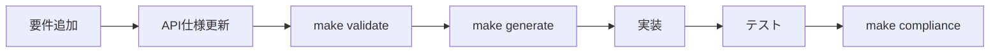

# プロジェクト初期化ガイド

## 概要

このガイドでは、Agentixシステムを使用して新規プロジェクトを立ち上げる手順を説明します。
バックエンドとフロントエンドの齟齬をなくし、API仕様ファーストの開発を実現します。

## システムの特徴

### 1. 要件駆動型開発
- `REQUIREMENTS.md`から自動的にエージェントを生成
- 各エージェントが専門分野を担当

### 2. API仕様ファースト
- OpenAPI + Go-Zero拡張による統一仕様
- 仕様書から全プラットフォームのコードを自動生成
- 型の不整合を完全に防止

### 3. 厳格なルール適用
- 生成されたコードの直接編集を禁止
- コミット時の自動検証
- コンプライアンスチェック

## 初期セットアップ手順

### ステップ1: プロジェクトの準備

```bash
# 新規プロジェクトディレクトリの作成
mkdir my-new-project
cd my-new-project

# Agentixシステムのコピー
cp -r /path/to/Agentix/* .

# 初期状態へリセット（必要な場合）
./scripts/reset_to_initial.sh
```

### ステップ2: 要件定義の作成

`REQUIREMENTS.md`を編集して、プロジェクトの要件を定義：

```markdown
# プロジェクト要件定義書

## プロジェクト概要
- プロジェクト名: MyApp
- 説明: [プロジェクトの説明]

## 技術スタック
- バックエンド: Go-Zero
- フロントエンド: Next.js 15
- モバイル: Expo

## 主要機能
1. ユーザー認証
2. データ管理
3. リアルタイム通信

## エージェント定義
- api: APIバックエンド開発
- next: Next.jsフロントエンド開発
- expo: Expoモバイル開発
```

### ステップ3: 基本セットアップの実行

```bash
# 基本構造のセットアップ
./scripts/setup.sh

# 要件からエージェントを生成
./scripts/generate_agents_from_requirements.sh
```

この時点で以下が作成されます：
- `.claude/` - エージェント設定
- `api-spec-system/` - API仕様システム
- `docs/agents/` - ドキュメント

### ステップ4: API仕様の定義

`api-spec-system/specs/core/api-spec.yaml`を編集：

```yaml
openapi: 3.1.0
info:
  title: MyApp API
  version: 1.0.0

x-go-zero:
  service: myapp-api
  group: core

paths:
  /api/v1/users:
    get:
      operationId: getUsers
      x-go-zero:
        handler: GetUsersHandler
      x-frontend:
        swr: true
      x-mobile:
        offline: true
```

### ステップ5: コード生成と開発開始

```bash
# API仕様システムのセットアップ
cd api-spec-system
npm install

# コード生成
make generate

# 準拠性チェック
make compliance

# モックサーバー起動
make mock-server
```

## 開発ワークフロー

### 1. 新機能追加フロー



### 2. 日常的な作業

```bash
# 仕様変更時
1. specs/*.yamlを編集
2. make validate
3. make generate
4. 生成されたスタブに実装を追加

# コミット時（自動実行）
- 仕様検証
- コード再生成
- 型チェック
```

### 3. エージェントの活用

ClaudeCodeで作業時：
```
"APIエンドポイントを実装してください"
→ apiエージェントが自動的に選択され、仕様書から開始

"フロントエンドでユーザー一覧を表示"
→ nextエージェントが自動生成されたhooksを使用
```

## プロジェクト構造

```
my-new-project/
├── .claude/                    # エージェント設定
│   ├── agents/                # エージェント定義
│   ├── agents-config.yaml     # API仕様ルール
│   └── task-templates.yaml    # タスクテンプレート
├── .claude-templates/          # テンプレート（保持）
├── api-spec-system/           # API仕様システム
│   ├── specs/                 # API仕様書
│   │   ├── core/             # コア仕様
│   │   └── services/         # サービス別
│   ├── generated/            # 自動生成（編集禁止）
│   │   ├── backend/         # Go-Zero
│   │   ├── frontend/        # Next.js
│   │   └── mobile/          # Expo
│   ├── templates/            # 生成テンプレート
│   ├── scripts/              # 生成スクリプト
│   └── Makefile             # コマンド集
├── scripts/                   # システムスクリプト
│   ├── setup.sh              # 初期セットアップ
│   ├── generate_agents_from_requirements.sh
│   └── reset_to_initial.sh  # 初期化
├── REQUIREMENTS.md           # 要件定義書
└── CLAUDE.md                # エージェント指示書
```

## リセットと再初期化

### プロジェクトを初期状態に戻す

```bash
# 生成物を削除し、初期状態に戻す
./scripts/reset_to_initial.sh

# 保持されるもの：
# - REQUIREMENTS.md
# - scripts/
# - .claude-templates/
# - api-spec-system/（本体のみ）
```

### 再セットアップ

```bash
# 基本セットアップ
./scripts/setup.sh

# エージェント再生成
./scripts/generate_agents_from_requirements.sh

# API仕様システム再初期化
cd api-spec-system
npm install
```

## ベストプラクティス

### 1. 要件定義
- プロジェクト開始時に`REQUIREMENTS.md`を詳細に記述
- エージェントの役割を明確に定義
- 技術スタックを明示

### 2. API設計
- 仕様書ファーストを徹底
- 破壊的変更を避ける
- バージョニング戦略を決定

### 3. 開発プロセス
- 毎日`make compliance`を実行
- コミット前に必ず検証
- 生成コードは直接編集しない

### 4. チーム開発
- 仕様書をレビュー対象に
- CI/CDでコンプライアンスチェック
- ドキュメントを常に最新に

## トラブルシューティング

### 生成エラー
```bash
make clean
make generate
```

### 型の不整合
```bash
make validate
make compliance
```

### Git hooks動作しない
```bash
cd api-spec-system
make setup-hooks
```

## まとめ

このシステムにより：
1. **要件駆動**: `REQUIREMENTS.md`から自動的にエージェント生成
2. **型安全**: API仕様から全プラットフォームの型を自動生成
3. **品質保証**: コミット時の自動検証で不整合を防止
4. **効率化**: 手動コーディングを最小限に

これらの仕組みにより、バックエンドとフロントエンドの齟齬を完全に防ぎ、高品質なプロジェクトを効率的に開発できます。