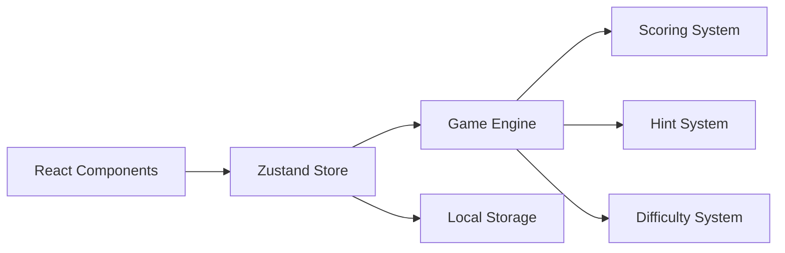

# GuessNumber API仕様書

## 📋 概要
GuessNumberアプリケーションのAPI仕様書です。本アプリケーションはフロントエンドのみの構成ですが、LocalStorage API、Zustand Store API、およびゲームエンジンのインターフェースについて詳述します。

---

## 🏗️ アーキテクチャ概要



### APIの種類
1. **Zustand Store API**: グローバル状態管理
2. **Game Engine API**: ゲームロジック処理
3. **LocalStorage API**: データ永続化
4. **Component Props API**: コンポーネント間通信

---

## 🗃️ データモデル

### 基本型定義

#### Difficulty（難易度）
```typescript
type Difficulty = 'easy' | 'normal' | 'hard';
```

#### GameStatus（ゲーム状態）
```typescript
type GameStatus = 'idle' | 'playing' | 'won' | 'lost';
```

#### GameState（ゲーム状態）
```typescript
interface GameState {
  target: number;           // 正解の数値
  upper: number;            // 数値の上限
  guesses: number[];        // 推測履歴
  attemptsLeft: number;     // 残り試行回数
  timeLeftSec?: number;     // 残り時間（秒）
  status: GameStatus;       // ゲーム状態
  startedAt?: number;       // 開始時刻（Unix timestamp）
  hintsUsed: number;        // 使用済みヒント数
  currentRange: [number, number]; // 推測可能範囲
}
```

#### GuessResult（推測結果）
```typescript
interface GuessResult {
  guess: number;            // 推測した数値
  result: 'correct' | 'too_high' | 'too_low';
  attemptsLeft: number;     // 残り試行回数
  timeLeft?: number;        // 残り時間
  gameEnded: boolean;       // ゲーム終了フラグ
  won: boolean;            // 勝利フラグ
}
```

#### ScoreResult（スコア結果）
```typescript
interface ScoreResult {
  baseScore: number;        // 基本スコア
  timeBonus: number;        // 時間ボーナス
  attemptBonus: number;     // 試行回数ボーナス
  hintPenalty: number;      // ヒントペナルティ
  specialBonuses: {         // 特別ボーナス
    perfect?: number;       // パーフェクトクリア
    speed?: number;         // スピードクリア
    noHint?: number;        // ノーヒント
    consecutive?: number;   // 連続クリア
  };
  totalScore: number;       // 総スコア
  multiplier: number;       // 難易度倍率
}
```

---

## 🎮 Zustand Store API

### Store State Structure
```typescript
interface GameStore {
  // ゲーム状態
  gameState: GameState | null;
  currentDifficulty: Difficulty;
  hintManager: HintManager | null;
  isPlaying: boolean;
  
  // 設定
  settings: Settings;
  
  // 記録・履歴
  bestRecords: Record<Difficulty, BestRecord | null>;
  gameHistory: GameHistory[];
  
  // UI状態
  showSettings: boolean;
  showStatistics: boolean;
  showHistory: boolean;
}
```

### Game Actions

#### startNewGame
新しいゲームを開始します。

**Signature**
```typescript
startNewGame: (difficulty: Difficulty) => void;
```

**Parameters**
- `difficulty`: 難易度設定

**Example**
```typescript
const startNewGame = useGameStore(state => state.startNewGame);
startNewGame('normal');
```

#### makeGuess
プレイヤーの推測を処理します。

**Signature**
```typescript
makeGuess: (guess: number) => Promise<{
  result: GuessResult;
  scoreResult?: ScoreResult;
}>;
```

**Parameters**
- `guess`: 推測する数値

**Returns**
- `result`: 推測結果
- `scoreResult`: ゲーム終了時のスコア結果（勝利時のみ）

**Example**
```typescript
const makeGuess = useGameStore(state => state.makeGuess);

try {
  const { result, scoreResult } = await makeGuess(42);
  
  if (result.gameEnded && result.won) {
    console.log('ゲームクリア！スコア:', scoreResult?.totalScore);
  }
} catch (error) {
  console.error('推測エラー:', error.message);
}
```

#### useHint
ヒントを使用します。

**Signature**
```typescript
useHint: (hintType: HintType) => Hint;
```

**Parameters**
- `hintType`: ヒントの種類（'range' | 'parity' | 'digit'）

**Returns**
- `Hint`: ヒント情報

**Example**
```typescript
const useHint = useGameStore(state => state.useHint);

try {
  const hint = useHint('range');
  console.log(hint.message); // "正解は25〜35の間にあります"
} catch (error) {
  console.error('ヒントエラー:', error.message);
}
```

### Settings Actions

#### updateSettings
アプリケーション設定を更新します。

**Signature**
```typescript
updateSettings: (settings: Partial<Settings>) => void;
```

**Parameters**
- `settings`: 更新する設定項目

**Example**
```typescript
const updateSettings = useGameStore(state => state.updateSettings);

updateSettings({
  sound: true,
  theme: 'dark',
  colorBlindMode: false
});
```

### Record Actions

#### saveGameRecord
ゲーム記録を保存します。

**Signature**
```typescript
saveGameRecord: (
  state: GameState, 
  scoreResult: ScoreResult, 
  difficulty: Difficulty
) => void;
```

**Parameters**
- `state`: 完了時のゲーム状態
- `scoreResult`: スコア結果
- `difficulty`: プレイした難易度

---

## 🎯 Game Engine API

### GameEngine Class

#### initializeGame
新しいゲーム状態を初期化します。

**Signature**
```typescript
initializeGame(difficulty: Difficulty): GameState;
```

**Parameters**
- `difficulty`: ゲーム難易度

**Returns**
- `GameState`: 初期化されたゲーム状態

**Example**
```typescript
const gameEngine = new GameEngine();
const gameState = gameEngine.initializeGame('normal');

console.log(gameState.upper);        // 50
console.log(gameState.attemptsLeft); // 8
console.log(gameState.timeLeftSec);  // 90
```

#### makeGuess
推測を処理し結果を返します。

**Signature**
```typescript
makeGuess(guess: number, state: GameState): GuessResult;
```

**Parameters**
- `guess`: プレイヤーの推測値
- `state`: 現在のゲーム状態

**Returns**
- `GuessResult`: 推測結果

**Throws**
- `Error`: 無効な推測値の場合

**Example**
```typescript
const gameEngine = new GameEngine();
const gameState = gameEngine.initializeGame('easy');

try {
  const result = gameEngine.makeGuess(25, gameState);
  
  switch (result.result) {
    case 'correct':
      console.log('正解です！');
      break;
    case 'too_high':
      console.log('もっと小さい数字です');
      break;
    case 'too_low':
      console.log('もっと大きい数字です');
      break;
  }
} catch (error) {
  console.error('無効な推測:', error.message);
}
```

#### validateGuess
推測値のバリデーションを実行します。

**Signature**
```typescript
validateGuess(guess: number, state: GameState): ValidationResult;
```

**Parameters**
- `guess`: 検証する推測値
- `state`: 現在のゲーム状態

**Returns**
- `ValidationResult`: バリデーション結果

**Example**
```typescript
const validation = gameEngine.validateGuess(25, gameState);

if (!validation.isValid) {
  console.error('バリデーションエラー:', validation.message);
  // エラー処理
}
```

---

## 💯 Scoring System API

### ScoreCalculator Class

#### calculateTotalScore
最終スコアを計算します。

**Signature**
```typescript
static calculateTotalScore(
  gameState: GameState,
  difficulty: Difficulty,
  completionTime: number,
  isConsecutive: boolean
): ScoreResult;
```

**Parameters**
- `gameState`: 完了時のゲーム状態
- `difficulty`: プレイした難易度
- `completionTime`: 完了までの時間（ミリ秒）
- `isConsecutive`: 連続クリアフラグ

**Returns**
- `ScoreResult`: スコア計算結果

**Example**
```typescript
const scoreResult = ScoreCalculator.calculateTotalScore(
  gameState,
  'normal',
  45000, // 45秒
  false  // 連続クリアなし
);

console.log('総スコア:', scoreResult.totalScore);
console.log('基本スコア:', scoreResult.baseScore);
console.log('時間ボーナス:', scoreResult.timeBonus);
```

### RecordManager Class

#### createGameHistory
ゲーム履歴エントリを作成します。

**Signature**
```typescript
static createGameHistory(
  difficulty: Difficulty,
  target: number,
  guesses: number[],
  timeMs: number,
  won: boolean,
  score?: number
): GameHistory;
```

**Parameters**
- `difficulty`: プレイした難易度
- `target`: 正解だった数値
- `guesses`: 推測履歴
- `timeMs`: プレイ時間（ミリ秒）
- `won`: 勝利フラグ
- `score`: 獲得スコア（オプション）

**Returns**
- `GameHistory`: ゲーム履歴エントリ

---

## 💡 Hint System API

### HintManager Class

#### Constructor
指定した難易度でHintManagerを初期化します。

**Signature**
```typescript
constructor(difficulty: Difficulty)
```

**Parameters**
- `difficulty`: 対象の難易度

#### useHint
指定したタイプのヒントを生成します。

**Signature**
```typescript
useHint(gameState: GameState, hintType: HintType): Hint;
```

**Parameters**
- `gameState`: 現在のゲーム状態
- `hintType`: 要求するヒントの種類

**Returns**
- `Hint`: 生成されたヒント

**Throws**
- `Error`: ヒントが使用できない場合

**Example**
```typescript
const hintManager = new HintManager('normal');

try {
  const rangeHint = hintManager.useHint(gameState, 'range');
  console.log(rangeHint.message); // "正解は20〜30の間にあります"
  
  const parityHint = hintManager.useHint(gameState, 'parity');
  console.log(parityHint.message); // "正解は奇数です"
} catch (error) {
  console.error('ヒント使用不可:', error.message);
}
```

#### canUseHint
指定したヒントが使用可能かチェックします。

**Signature**
```typescript
canUseHint(gameState: GameState, hintType: HintType): boolean;
```

**Parameters**
- `gameState`: 現在のゲーム状態
- `hintType`: チェックするヒントタイプ

**Returns**
- `boolean`: 使用可能かどうか

---

## 📊 Difficulty System API

### DifficultyManager Class

#### getConfig
指定した難易度の設定を取得します。

**Signature**
```typescript
static getConfig(difficulty: Difficulty): ExtendedDifficultyConfig;
```

**Parameters**
- `difficulty`: 対象の難易度

**Returns**
- `ExtendedDifficultyConfig`: 難易度設定

**Example**
```typescript
const config = DifficultyManager.getConfig('hard');

console.log('数値範囲:', config.range);     // [1, 100]
console.log('試行回数:', config.attempts);   // 7
console.log('制限時間:', config.timeLimitSec); // 60
```

#### getRecommendedNextDifficulty
プレイヤーのパフォーマンスから推奨難易度を取得します。

**Signature**
```typescript
static getRecommendedNextDifficulty(
  currentDifficulty: Difficulty,
  score: number,
  attempts: number,
  timeUsed?: number
): Difficulty;
```

**Parameters**
- `currentDifficulty`: 現在の難易度
- `score`: 獲得スコア
- `attempts`: 使用試行回数
- `timeUsed`: 使用時間（秒）

**Returns**
- `Difficulty`: 推奨難易度

---

## 💾 LocalStorage API

### Storage Keys
```typescript
const STORAGE_KEYS = {
  SETTINGS: 'gn_settings',
  BEST_RECORDS: 'gn_best_records',
  GAME_HISTORY: 'gn_game_history',
  LAST_SESSION: 'gn_last_session',
};
```

### Data Structures

#### Settings Storage
```typescript
// Key: 'gn_settings'
interface StoredSettings {
  difficulty: Difficulty;
  sound: boolean;
  colorBlindMode: boolean;
  theme: 'light' | 'dark' | 'auto';
}
```

#### Best Records Storage
```typescript
// Key: 'gn_best_records'
type StoredBestRecords = Record<Difficulty, BestRecord | null>;

interface BestRecord {
  difficulty: Difficulty;
  timeMs: number;
  attempts: number;
  updatedAt: string;    // ISO date string
  score: number;
}
```

#### Game History Storage
```typescript
// Key: 'gn_game_history'
interface StoredGameHistory {
  id: string;           // UUID
  difficulty: Difficulty;
  target: number;
  guesses: number[];
  timeMs: number;
  won: boolean;
  playedAt: string;     // ISO date string
  score?: number;
}
```

#### Last Session Storage
```typescript
// Key: 'gn_last_session'
interface StoredLastSession {
  gameState: GameState;
  difficulty: Difficulty;
  timestamp: number;    // Unix timestamp
}
```

### Storage Operations

#### Save Data
```typescript
// 設定の保存
localStorage.setItem(
  STORAGE_KEYS.SETTINGS, 
  JSON.stringify(settings)
);

// 最高記録の保存
localStorage.setItem(
  STORAGE_KEYS.BEST_RECORDS,
  JSON.stringify(bestRecords)
);
```

#### Load Data
```typescript
// 設定の読み込み
const settingsData = localStorage.getItem(STORAGE_KEYS.SETTINGS);
const settings = settingsData ? JSON.parse(settingsData) : defaultSettings;

// 最高記録の読み込み
const recordsData = localStorage.getItem(STORAGE_KEYS.BEST_RECORDS);
const bestRecords = recordsData ? JSON.parse(recordsData) : defaultRecords;
```

---

## 🎯 Custom Hooks API

### useGameStore Selectors

#### ゲーム状態関連
```typescript
const gameState = useGameStore(state => state.gameState);
const isPlaying = useGameStore(state => state.isPlaying);
const currentDifficulty = useGameStore(state => state.currentDifficulty);
```

#### 設定関連
```typescript
const settings = useGameStore(state => state.settings);
const updateSettings = useGameStore(state => state.updateSettings);
```

#### 記録関連
```typescript
const bestRecords = useGameStore(state => state.bestRecords);
const gameHistory = useGameStore(state => state.gameHistory);
```

### Specialized Hooks

#### useBestRecord
```typescript
// 全難易度の最高記録を取得
const allRecords = useBestRecord();

// 特定難易度の最高記録を取得
const hardRecord = useBestRecord('hard');
```

#### useGameHistory
```typescript
// 全履歴を取得
const allHistory = useGameHistory();

// 特定難易度の履歴を取得
const normalHistory = useGameHistory('normal');

// 最新5件の履歴を取得
const recentHistory = useGameHistory(undefined, 5);
```

#### useCurrentGameStats
```typescript
const stats = useCurrentGameStats();
console.log(stats.timeElapsed);    // 経過時間
console.log(stats.attemptsUsed);   // 使用済み試行回数
console.log(stats.hintsUsed);      // 使用済みヒント数
console.log(stats.currentRange);   // 現在の推測範囲
```

---

## 🔧 エラーハンドリング

### Error Types
```typescript
enum GameError {
  INVALID_INPUT = 'INVALID_INPUT',
  OUT_OF_RANGE = 'OUT_OF_RANGE',
  DUPLICATE_GUESS = 'DUPLICATE_GUESS',
  GAME_ALREADY_FINISHED = 'GAME_ALREADY_FINISHED',
  HINT_NOT_AVAILABLE = 'HINT_NOT_AVAILABLE',
  TIME_LIMIT_EXCEEDED = 'TIME_LIMIT_EXCEEDED'
}
```

### Error Messages (Japanese)
```typescript
const ERROR_MESSAGES = {
  [GameError.INVALID_INPUT]: '無効な入力値です',
  [GameError.OUT_OF_RANGE]: '範囲外の数値です',
  [GameError.DUPLICATE_GUESS]: '既に推測済みの数値です',
  [GameError.GAME_ALREADY_FINISHED]: 'ゲームは既に終了しています',
  [GameError.HINT_NOT_AVAILABLE]: 'このヒントは使用できません',
  [GameError.TIME_LIMIT_EXCEEDED]: '制限時間を超過しました',
};
```

### Error Handling Pattern
```typescript
try {
  const result = await makeGuess(guess);
  // 成功時の処理
} catch (error) {
  if (error instanceof GameError) {
    // ゲーム固有エラーの処理
    showErrorMessage(ERROR_MESSAGES[error.type]);
  } else {
    // 予期しないエラーの処理
    console.error('予期しないエラー:', error);
    showErrorMessage('システムエラーが発生しました');
  }
}
```

---

## 🚀 パフォーマンス最適化

### State Selectors
```typescript
// ❌ Bad: 全体状態を監視（無駄な再レンダリング）
const state = useGameStore();

// ✅ Good: 必要な部分のみを監視
const gameState = useGameStore(state => state.gameState);
const isPlaying = useGameStore(state => state.isPlaying);
```

### Memoization
```typescript
// 計算量の多い処理はuseMemoで最適化
const gameStats = useMemo(() => {
  if (!gameState) return null;
  
  return {
    progressPercentage: (gameState.guesses.length / gameState.attemptsLeft) * 100,
    efficiency: calculateEfficiency(gameState),
    estimatedTimeLeft: calculateTimeEstimate(gameState),
  };
}, [gameState]);
```

### Batch Updates
```typescript
// 複数の状態更新を一括実行
const handleGameEnd = useCallback((won: boolean, scoreResult: ScoreResult) => {
  // Zustandは自動的にバッチ更新を行う
  endGame(won);
  if (won) {
    saveGameRecord(gameState!, scoreResult, currentDifficulty);
  }
}, [gameState, currentDifficulty]);
```

---

## 📝 使用例

### 基本的なゲームフロー
```typescript
import { useGameStore } from '@/lib/game-store';

function GameComponent() {
  const {
    gameState,
    isPlaying,
    startNewGame,
    makeGuess,
    useHint
  } = useGameStore();

  // ゲーム開始
  const handleStartGame = () => {
    startNewGame('normal');
  };

  // 推測実行
  const handleGuess = async (guess: number) => {
    try {
      const { result, scoreResult } = await makeGuess(guess);
      
      if (result.gameEnded) {
        if (result.won) {
          alert(`クリア！スコア: ${scoreResult?.totalScore}`);
        } else {
          alert('ゲームオーバー');
        }
      }
    } catch (error) {
      alert(error.message);
    }
  };

  // ヒント使用
  const handleUseHint = () => {
    try {
      const hint = useHint('range');
      alert(hint.message);
    } catch (error) {
      alert(error.message);
    }
  };

  return (
    <div>
      {!isPlaying ? (
        <button onClick={handleStartGame}>
          ゲーム開始
        </button>
      ) : (
        <div>
          <p>残り試行回数: {gameState?.attemptsLeft}</p>
          <input 
            type="number" 
            onKeyDown={(e) => {
              if (e.key === 'Enter') {
                handleGuess(Number(e.currentTarget.value));
              }
            }}
          />
          <button onClick={handleUseHint}>
            ヒントを使う
          </button>
        </div>
      )}
    </div>
  );
}
```

---

**API仕様は継続的に更新されます。最新情報は実際のコードを参照してください。**

*最終更新: 2025年8月26日*