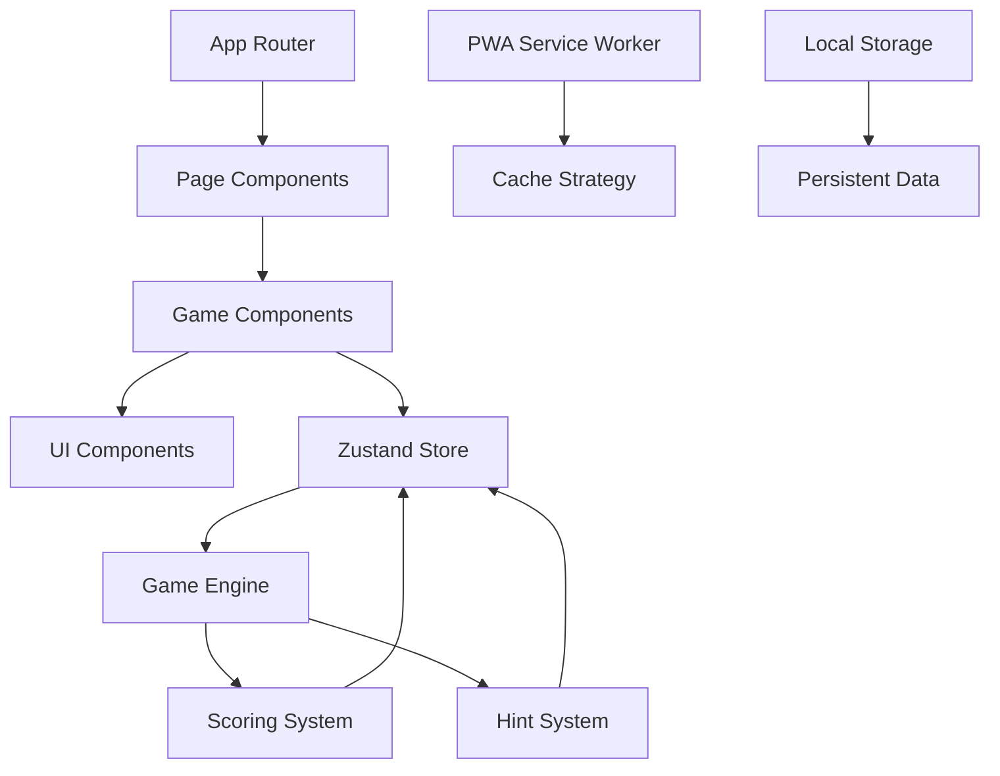

# GuessNumber 開発者ガイド

## 📋 目次
1. [プロジェクト概要](#プロジェクト概要)
2. [アーキテクチャ](#アーキテクチャ)
3. [技術スタック詳細](#技術スタック詳細)
4. [プロジェクト構造](#プロジェクト構造)
5. [主要コンポーネント](#主要コンポーネント)
6. [状態管理](#状態管理)
7. [ゲームロジック](#ゲームロジック)
8. [開発環境構築](#開発環境構築)
9. [テスト](#テスト)
10. [ビルド・デプロイ](#ビルド・デプロイ)
11. [カスタマイズ](#カスタマイズ)
12. [貢献ガイドライン](#貢献ガイドライン)

---

## 🏗️ プロジェクト概要

### 設計方針
- **型安全性**: TypeScript による厳格な型定義
- **コンポーネント分離**: 責務を明確に分離した構造
- **状態管理の統一**: Zustand によるシンプルな状態管理
- **テスト駆動**: Vitest + React Testing Library による品質保証
- **PWA対応**: オフライン機能とインストール機能

### 開発原則
- **Single Responsibility**: 各コンポーネント・関数は単一の責務
- **DRY (Don't Repeat Yourself)**: 重複コードの排除
- **SOLID原則**: オブジェクト指向設計の基本原則
- **アクセシビリティファースト**: WCAG 2.1準拠

---

## 🏛️ アーキテクチャ



### レイヤー構造
1. **プレゼンテーション層**: React Components
2. **ビジネスロジック層**: Game Engine, Scoring, Hints
3. **状態管理層**: Zustand Store
4. **データ永続化層**: LocalStorage + PWA Cache

---

## 💻 技術スタック詳細

### フロントエンド
```json
{
  "framework": "Next.js 15",
  "language": "TypeScript",
  "stateManagement": "Zustand",
  "styling": "Tailwind CSS v4",
  "uiComponents": "Headless UI + CVA",
  "testing": "Vitest + React Testing Library"
}
```

### 開発ツール
```json
{
  "packageManager": "pnpm",
  "linting": "ESLint",
  "formatting": "Prettier",
  "gitHooks": "Husky + lint-staged",
  "bundler": "Next.js (Turbopack)"
}
```

### PWA技術
```json
{
  "serviceWorker": "Workbox",
  "manifest": "Web App Manifest",
  "caching": "Cache First + Network First",
  "offline": "Complete offline support"
}
```

---

## 📁 プロジェクト構造

```
guess-number-app/
├── 📁 src/                          # ソースコード
│   ├── 📁 app/                      # Next.js App Router
│   │   ├── 📄 layout.tsx           # ルートレイアウト
│   │   ├── 📄 page.tsx             # メインページ
│   │   └── 📄 globals.css          # グローバルスタイル
│   │
│   ├── 📁 components/              # Reactコンポーネント
│   │   ├── 📁 game/                # ゲーム関連コンポーネント
│   │   │   ├── 📄 DifficultySelector.tsx
│   │   │   ├── 📄 GameBoard.tsx
│   │   │   ├── 📄 GameOverModal.tsx
│   │   │   ├── 📄 GameStatus.tsx
│   │   │   ├── 📄 NumberInput.tsx
│   │   │   └── 📄 ScoreDisplay.tsx
│   │   │
│   │   ├── 📁 ui/                  # 汎用UIコンポーネント
│   │   │   ├── 📄 Button.tsx
│   │   │   ├── 📄 Card.tsx
│   │   │   ├── 📄 Input.tsx
│   │   │   └── 📄 LoadingSpinner.tsx
│   │   │
│   │   ├── 📄 Accessibility.tsx    # アクセシビリティ対応
│   │   ├── 📄 ErrorBoundary.tsx    # エラー境界
│   │   ├── 📄 PWAWrapper.tsx       # PWAラッパー
│   │   └── 📄 StoreInitializer.tsx # 状態初期化
│   │
│   ├── 📁 lib/                     # ビジネスロジック・ユーティリティ
│   │   ├── 📁 __tests__/           # テストファイル
│   │   ├── 📄 difficulty.ts        # 難易度システム
│   │   ├── 📄 game-engine.ts       # ゲームエンジン
│   │   ├── 📄 game-store.ts        # Zustand状態管理
│   │   ├── 📄 hints.ts             # ヒントシステム
│   │   ├── 📄 scoring.ts           # スコア計算
│   │   └── 📄 utils.ts             # 汎用ユーティリティ
│   │
│   ├── 📁 styles/                  # スタイル関連
│   │   └── 📄 design-tokens.ts     # デザイントークン
│   │
│   ├── 📁 test/                    # テスト設定
│   │   └── 📄 setup.ts
│   │
│   └── 📁 types/                   # TypeScript型定義
│       └── 📄 game.ts              # ゲーム関連型
│
├── 📁 public/                      # 静的ファイル
│   ├── 📁 icons/                   # PWAアイコン
│   ├── 📄 manifest.json            # PWAマニフェスト
│   └── 📄 sw.js                    # Service Worker
│
├── 📁 docs/                        # ドキュメント
└── 📁 .vscode/                     # VS Code設定
```

---

## 🧩 主要コンポーネント

### App Router構造
```typescript
// app/layout.tsx - ルートレイアウト
export default function RootLayout({
  children,
}: {
  children: React.ReactNode;
}) {
  return (
    <html lang="ja">
      <body>
        <StoreInitializer>
          <PWAWrapper>
            <ErrorBoundary>
              <Accessibility>
                {children}
              </Accessibility>
            </ErrorBoundary>
          </PWAWrapper>
        </StoreInitializer>
      </body>
    </html>
  );
}
```

### ゲームコンポーネント階層
```
GameBoard (メインゲーム画面)
├── DifficultySelector (難易度選択)
├── GameStatus (ゲーム状態表示)
├── NumberInput (数値入力)
├── ScoreDisplay (スコア表示)
└── GameOverModal (結果モーダル)
```

### UIコンポーネント設計
```typescript
// components/ui/Button.tsx
import { cva, type VariantProps } from 'class-variance-authority';

const buttonVariants = cva(
  'inline-flex items-center justify-center rounded-md font-medium',
  {
    variants: {
      variant: {
        default: 'bg-blue-600 text-white hover:bg-blue-700',
        outline: 'border border-gray-300 bg-transparent',
        ghost: 'hover:bg-gray-100',
      },
      size: {
        sm: 'h-9 px-3 text-sm',
        md: 'h-10 px-4',
        lg: 'h-11 px-8',
      },
    },
    defaultVariants: {
      variant: 'default',
      size: 'md',
    },
  }
);
```

---

## 🗂️ 状態管理（Zustand）

### ストア構造
```typescript
interface GameStore {
  // ゲーム状態
  gameState: GameState | null;
  currentDifficulty: Difficulty;
  isPlaying: boolean;
  
  // 設定・記録
  settings: Settings;
  bestRecords: Record<Difficulty, BestRecord | null>;
  gameHistory: GameHistory[];
  
  // UI状態
  showSettings: boolean;
  showStatistics: boolean;
  showHistory: boolean;
  
  // アクション
  startNewGame: (difficulty: Difficulty) => void;
  makeGuess: (guess: number) => Promise<GuessResult>;
  useHint: (hintType: HintType) => Hint;
  // ... その他のアクション
}
```

### 状態の永続化
```typescript
// Zustand persist middleware使用
export const useGameStore = create<GameStore>()(
  persist(
    (set, get) => ({
      // store implementation
    }),
    {
      name: 'guess-number-storage',
      storage: createJSONStorage(() => localStorage),
      partialize: (state) => ({
        settings: state.settings,
        bestRecords: state.bestRecords,
        gameHistory: state.gameHistory,
      }),
    }
  )
);
```

### カスタムフック
```typescript
// 特定の状態にアクセスするためのカスタムフック
export const useBestRecord = (difficulty?: Difficulty) => {
  return useGameStore(state => 
    difficulty ? state.bestRecords[difficulty] : state.bestRecords
  );
};

export const useCurrentGameStats = () => {
  return useGameStore(state => state.getCurrentGameStats());
};
```

---

## 🎮 ゲームロジック

### ゲームエンジン（GameEngine）
```typescript
export class GameEngine {
  /**
   * ゲーム初期化
   */
  initializeGame(difficulty: Difficulty): GameState {
    const config = DifficultyManager.getConfig(difficulty);
    const target = this.generateRandomNumber(config.range);
    
    return {
      target,
      upper: config.upper,
      guesses: [],
      attemptsLeft: config.attempts,
      timeLeftSec: config.timeLimitSec,
      status: 'playing',
      startedAt: Date.now(),
      hintsUsed: 0,
      currentRange: [1, config.upper],
    };
  }
  
  /**
   * 推測処理
   */
  makeGuess(guess: number, state: GameState): GuessResult {
    // バリデーション
    const validation = this.validateGuess(guess, state);
    if (!validation.isValid) {
      throw new Error(validation.message);
    }
    
    // 推測結果の判定
    const result = this.evaluateGuess(guess, state.target);
    
    // ゲーム状態の更新
    const gameEnded = this.checkGameEnd(result, state);
    
    return {
      guess,
      result,
      attemptsLeft: state.attemptsLeft - 1,
      timeLeft: state.timeLeftSec,
      gameEnded,
      won: result === 'correct',
    };
  }
}
```

### スコア計算システム（ScoreCalculator）
```typescript
export class ScoreCalculator {
  static calculateTotalScore(
    gameState: GameState,
    difficulty: Difficulty,
    completionTime: number,
    isConsecutive: boolean
  ): ScoreResult {
    const config = EXTENDED_DIFFICULTY_CONFIGS[difficulty];
    
    // 基本スコア計算
    const baseScore = SCORE_CONFIG.baseCompletionBonus;
    
    // ボーナス計算
    const timeBonus = this.calculateTimeBonus(gameState, config);
    const attemptBonus = this.calculateAttemptBonus(gameState, config);
    const specialBonuses = this.calculateSpecialBonuses(
      gameState, 
      completionTime, 
      isConsecutive
    );
    
    // ペナルティ計算
    const hintPenalty = gameState.hintsUsed * SCORE_CONFIG.hintPenalty;
    
    // 最終スコア
    const totalBeforeMultiplier = 
      baseScore + timeBonus + attemptBonus + 
      Object.values(specialBonuses).reduce((a, b) => a + b, 0) - 
      hintPenalty;
    
    const multiplier = SCORE_CONFIG.difficultyMultipliers[difficulty];
    const totalScore = Math.max(0, Math.floor(totalBeforeMultiplier * multiplier));
    
    return {
      baseScore,
      timeBonus,
      attemptBonus,
      hintPenalty,
      specialBonuses,
      totalScore,
      multiplier,
    };
  }
}
```

### ヒントシステム（HintManager）
```typescript
export class HintManager {
  constructor(private difficulty: Difficulty) {}
  
  useHint(gameState: GameState, hintType: HintType): Hint {
    // ヒント使用可能性チェック
    if (!this.canUseHint(gameState, hintType)) {
      throw new Error('このヒントは使用できません');
    }
    
    switch (hintType) {
      case 'range':
        return this.generateRangeHint(gameState);
      case 'parity':
        return this.generateParityHint(gameState);
      case 'digit':
        return this.generateDigitHint(gameState);
      default:
        throw new Error('不正なヒントタイプです');
    }
  }
  
  private generateRangeHint(gameState: GameState): RangeHint {
    const target = gameState.target;
    const rangeSize = Math.ceil(gameState.upper * 0.3); // 30%の範囲
    const start = Math.max(1, target - Math.floor(rangeSize / 2));
    const end = Math.min(gameState.upper, start + rangeSize);
    
    return {
      type: 'range',
      message: `正解は${start}〜${end}の間にあります`,
      range: [start, end],
      accuracy: 'rough',
      used: true,
    };
  }
}
```

---

## 🛠️ 開発環境構築

### 必要な環境
```bash
# Node.js (LTS推奨)
node --version  # v20.0.0以上

# pnpm (推奨パッケージマネージャー)
npm install -g pnpm
pnpm --version  # 9.0.0以上
```

### プロジェクトセットアップ
```bash
# リポジトリクローン
git clone <repository-url>
cd guess-number-app

# 依存関係インストール
pnpm install

# 開発サーバー起動
pnpm dev
```

### VS Code設定
```json
// .vscode/settings.json
{
  "typescript.preferences.importModuleSpecifier": "relative",
  "editor.codeActionsOnSave": {
    "source.fixAll.eslint": true,
    "source.organizeImports": true
  },
  "editor.formatOnSave": true,
  "editor.defaultFormatter": "esbenp.prettier-vscode"
}
```

### 推奨拡張機能
```json
// .vscode/extensions.json
{
  "recommendations": [
    "esbenp.prettier-vscode",
    "ms-vscode.vscode-typescript-next",
    "bradlc.vscode-tailwindcss",
    "ms-vscode.vscode-json"
  ]
}
```

---

## 🧪 テスト

### テスト構造
```
src/lib/__tests__/
├── game-engine.test.ts      # ゲームエンジンテスト
├── scoring.test.ts          # スコア計算テスト
└── utils.test.ts           # ユーティリティテスト
```

### テスト実行コマンド
```bash
# 全テスト実行
pnpm test

# 監視モードでテスト実行
pnpm test:watch

# カバレッジ付きテスト実行
pnpm test:coverage

# テストUI起動
pnpm test:ui
```

### テスト例
```typescript
// game-engine.test.ts
import { describe, it, expect } from 'vitest';
import { GameEngine } from '../game-engine';

describe('GameEngine', () => {
  const gameEngine = new GameEngine();
  
  describe('initializeGame', () => {
    it('should initialize game with correct difficulty settings', () => {
      const gameState = gameEngine.initializeGame('normal');
      
      expect(gameState.upper).toBe(50);
      expect(gameState.attemptsLeft).toBe(8);
      expect(gameState.timeLeftSec).toBe(90);
      expect(gameState.status).toBe('playing');
    });
  });
  
  describe('makeGuess', () => {
    it('should return correct result for exact guess', () => {
      const gameState = gameEngine.initializeGame('easy');
      gameState.target = 15;
      
      const result = gameEngine.makeGuess(15, gameState);
      
      expect(result.result).toBe('correct');
      expect(result.won).toBe(true);
      expect(result.gameEnded).toBe(true);
    });
  });
});
```

### コンポーネントテスト
```typescript
// components/__tests__/GameBoard.test.tsx
import { render, screen, fireEvent } from '@testing-library/react';
import { describe, it, expect } from 'vitest';
import { GameBoard } from '../GameBoard';

describe('GameBoard', () => {
  it('should render game board with initial state', () => {
    render(<GameBoard />);
    
    expect(screen.getByRole('textbox')).toBeInTheDocument();
    expect(screen.getByRole('button', { name: '推測する' })).toBeInTheDocument();
  });
  
  it('should handle number input and guess submission', async () => {
    render(<GameBoard />);
    
    const input = screen.getByRole('textbox');
    const button = screen.getByRole('button', { name: '推測する' });
    
    fireEvent.change(input, { target: { value: '25' } });
    fireEvent.click(button);
    
    // ゲーム状態の変更をテスト
    expect(screen.getByText(/もっと|正解/)).toBeInTheDocument();
  });
});
```

---

## 🚀 ビルド・デプロイ

### プロダクションビルド
```bash
# ビルド実行
pnpm build

# ビルド結果確認
pnpm start

# ビルド結果のクリア
pnpm clean
```

### 静的エクスポート
```typescript
// next.config.mjs
/** @type {import('next').NextConfig} */
const nextConfig = {
  output: 'export',
  trailingSlash: true,
  images: {
    unoptimized: true,
  },
};

export default nextConfig;
```

### Vercelデプロイ
```bash
# Vercel CLI使用
npx vercel

# 本番デプロイ
npx vercel --prod
```

### その他プラットフォーム
- **Netlify**: `pnpm build` → `out` ディレクトリをデプロイ
- **GitHub Pages**: GitHub Actions でビルド・デプロイ
- **Cloudflare Pages**: Git連携で自動デプロイ

---

## 🎨 カスタマイズ

### テーマカスタマイズ
```typescript
// src/styles/design-tokens.ts
export const designTokens = {
  colors: {
    primary: {
      50: '#eff6ff',
      500: '#3b82f6',
      900: '#1e3a8a',
    },
    // カスタムカラーを追加
  },
  spacing: {
    // カスタムスペーシングを追加
  },
  fontSize: {
    // カスタムフォントサイズを追加
  },
};
```

### 新しい難易度追加
```typescript
// src/types/game.ts
export type Difficulty = 'easy' | 'normal' | 'hard' | 'expert';

// src/lib/difficulty.ts
export const EXTENDED_DIFFICULTY_CONFIGS: Record<Difficulty, ExtendedDifficultyConfig> = {
  // 既存の難易度...
  expert: {
    upper: 200,
    attempts: 5,
    timeLimitSec: 30,
    hintsAllowed: 0,
    range: [1, 200],
    scoreMultiplier: 3.0,
    hintTypes: [],
    description: 'エクストリーム チャレンジ',
    recommendedFor: 'エキスパート・競技プレイ',
  },
};
```

### 新しいヒントタイプ追加
```typescript
// src/types/game.ts
export type HintType = 'range' | 'parity' | 'digit' | 'divisible';

// src/lib/hints.ts
export class HintManager {
  private generateDivisibleHint(gameState: GameState): Hint {
    const target = gameState.target;
    const divisors = [2, 3, 5, 7].filter(d => target % d === 0);
    
    if (divisors.length > 0) {
      const divisor = divisors[0];
      return {
        type: 'divisible',
        message: `正解は${divisor}で割り切れます`,
        used: true,
      };
    }
    
    return {
      type: 'divisible',
      message: '正解は素数です',
      used: true,
    };
  }
}
```

---

## 🤝 貢献ガイドライン

### ブランチ戦略
```
main                    # 本番ブランチ
├── develop            # 開発ブランチ
├── feature/xxx        # 機能追加
├── bugfix/xxx         # バグ修正
└── hotfix/xxx         # 緊急修正
```

### コミット規約
```
feat: 新機能追加
fix: バグ修正
docs: ドキュメント更新
style: コードスタイル修正
refactor: リファクタリング
test: テスト追加・修正
chore: その他の変更
```

### Pull Request作成手順
1. Issueの作成（バグ報告・機能要望）
2. ブランチ作成 (`git checkout -b feature/issue-number`)
3. 実装・テスト追加
4. コミット（規約に従う）
5. Pull Request作成
6. コードレビュー・修正
7. マージ

### コードレビューポイント
- TypeScript型定義の妥当性
- テストカバレッジの確保
- アクセシビリティの考慮
- パフォーマンスの影響
- ドキュメント更新の必要性

### Issue報告テンプレート
```markdown
## バグ報告 / 機能要望

### 概要
<!-- 問題の概要を記述 -->

### 再現手順
1. 
2. 
3. 

### 期待される動作
<!-- 期待する動作を記述 -->

### 実際の動作
<!-- 実際に発生した動作を記述 -->

### 環境情報
- OS: 
- ブラウザ: 
- バージョン: 

### スクリーンショット
<!-- 可能であれば添付 -->
```

---

## 📚 参考資料

### 公式ドキュメント
- [Next.js Documentation](https://nextjs.org/docs)
- [TypeScript Handbook](https://www.typescriptlang.org/docs/)
- [Zustand Documentation](https://github.com/pmndrs/zustand)
- [Tailwind CSS Documentation](https://tailwindcss.com/docs)
- [Vitest Documentation](https://vitest.dev/)

### 開発ツール
- [React DevTools](https://react.dev/learn/react-developer-tools)
- [Redux DevTools](https://github.com/reduxjs/redux-devtools) (Zustand対応)
- [Lighthouse](https://developers.google.com/web/tools/lighthouse) (PWA検証)

---

**プロジェクトへの貢献を心よりお待ちしております！** 🚀

*最終更新: 2025年8月26日*